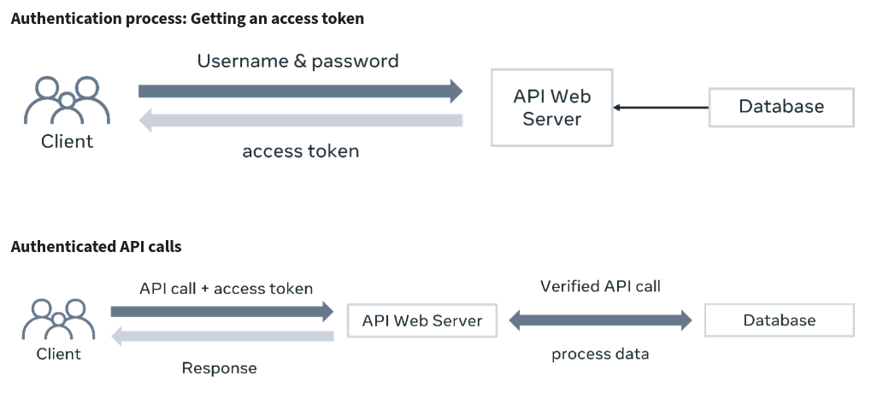

# HTTP

- HTTP(S) = Hyper Text Transfer Protocol (security)
- In HTTPS the client computer encrypts the data before sending it to the server. The server decrypts the data request to process it and send back a encrypt response. The client browser decrypt the response to exhibit it to you.
- HTTP Methods (verbs):
    * **GET**: retrieve a resource
    * **POST**: create a resource
    * **PUT**: update all resource
    * **PATCH**: update part of resource
    * **DELETE**: delete the resource
- HTTP requests contain:
    * HTTP Version Type
    * URL (path)
    * Method (verb)
    * Headers: is part of all HTTP request and contain extra information thats helps the server how to present the content (ex: cookies, user-agents, referrers).
    * Body (optional): used to transfer data in json format or in the encoded URL.
- HTTP response contain:
    * Request resource
    * Content length
    * Content type
    * Headers
    * ETags
    * Time last modification
    * HTPP status code:
        - **100-199**: informational. This range is mainly used to pass on some information. For example, sometimes an API needs time to process the request and it can’t instantly deliver the result. In such a case, the API developer can set it to keep returning 102 – Processing until the result is ready. This way, the client understands that the result isn’t ready and should be checked again.
        - **200-299**: successful responses
        - **300-399**: redirection information. Suppose as an API developer, you changed the API endpoint from /api/items to api/menu-items. If the client makes an API call to /api/items, then you can redirect the client to this new endpoint /api/menu-items with a 301 – Permanently moved status code so that the client can make new calls to that endpoint next time.  
        - **400-499**: client error responses (ex: bad API request, resource that is not on the server)
            * **404 - Not Found** if the client requests something that doesn’t exist
            * **400 - Bad Request** if a client sends an invalid payload with insufficient data
            * **401 - Unauthorized**
            * **403 - Forbidden** if the client tries to perform an action it's not authorized for.
        - **500-599**: server error (ex: error checks issues, configuration mismatch, package dependencies issues). These alarming status codes are usually automatically generated on the server side if something goes wrong in the code, and the API developer doesn't write code to deal with those errors. For example, a client requests a non-existing resource, and the API developer tries to display that resource without adequately checking if that resource exists in the database. Or if the API developer didn't validate the incoming data and attempted to create a new resource with invalid or insufficient data. You, as an API developer, should always avoid 5xx errors.  

## Response types
These days, the most common response types involved with REST APIs are JSON, XML, plain text, and sometimes YAML. Frameworks like DRF come with built-in renderer classes that can convert the data into an appropriate format and display it correctly.

There are also third-party renderers available for this job. While making an API call, the client can specify its desired response format with the **Accept HTTP header**. And that header should be considered to deliver the result in that format using the render classes. Here’s a list of HTTP headers for different response types. 

| Response type   |                       Request header                           |
|-----------------|:--------------------------------------------------------------:|
| HTML            |                     Accept: text/html                          |
| XML             |          Accept: application/xml, Accept: text/xml             |
| YAML | Accept: application/yaml,   Accept: application/x-yaml, Accept: text/yaml |

# REST 

Is an architectural style for design APIs. It is very popular for its simplicity:

- Easy to learn
- Quick to develop

To an API be RESTfull it must satisfy:

- **Client-server**
- **Stateless**: do not depend of previous states.
- **Cacheable**: possibility to chace response on the browser.
- **Layered**: you application could be split into layers and each layer could be chance (firewall, load balancer, web server, database server, etc).
- **Uniform interface** 
- **Optional code on demand**: Business logic, code that can improve results.

# Naming conventions

Naming your API properly is the first step in designing a good API. When the API name follows a convention, it provides lots of information about the API and its purpose. To create a meaningful API endpoint, you need to follow some simple guidelines and rules. 

**Vocabulary**: Uniform Resource Identifier (URI) = Endpoint = URL path.

There are some conventions:

- endpoint names must be in lowercase (```/orders``` and not ```/Orders```)
- Hyphens in between words (ex: ```/menu-items```)
- if your endpoint except parameters, you can represent them in Camel case (ex: ```orders/{orderId}/menu-items```).

Use forward slash (```/```) to indicate hierarchical relationships between related objects.

For example, a library has books, and books has authors:

```/library/books/{bookID}/author```

To get all books by an author:

```/library/authors/{authorName}/books```

You must use nouns instead of verbs. The following are some bad examples:

- ```/getAllBooks```
- ```/getUser/{userId}```
- ```users/{userId}/delete```
- ```/orders/{orderId}/save```

Do not specify the response format as part of the name endpoint like ```orders/{orderId}.json```, instead you could expect a query string that specify the data format response like ```/orders/{orderId}?format=json```.

For minified version of a JavaScript file you could use ```assets/js/jquery/3.6.0/min``` or ```assets/js/moment/2.29.4/original```.

Do not end your endpoint name with a forward slash (ex: ```/orders/{orderId}/```).

# REST best practices

- Principle KISS (keep it simple stupid): the idea is that your API need to do one specific simple job. 
- Always provide a way to filter, order and paginate. 
    - Pagination: your API will be able to send results in small chunks.
- Versioning your API
- Caching: your API must be able to cache results, in this way, you save resources in case to provide same answer.
- Rate limiting and monitoring: to prevent abuse of use.
    - limits call: number of calls per minute, or day. 
    - monitoring 
        - response time
        - status code
- Security

# Security

- **Secure Socket Layer (SSL)**: is a protocol that provides a secure communication channel over the internet between two endpoints. SSL can be used to secure APIs by encrypting the data in transit between the client and the server, thus preventing unauthorized access and interception of sensitive information. 

- **Transport Layer Security (TLS)**: is an upgraded version of SSL and provides improved security features.

- **Signed URLs**: limited access to a resource for a limited time. A signed URL is a URL that includes a cryptographic signature, which allows the server to authenticate the request and determine whether the request is authorized to access the protected resource. Instead of requiring the user to authenticate with a username and password, the server generates a signed URL that includes a **token**, which grants temporary access to the resource.

- **Hash-based Message Authentication Code (HMAC)**: is a cryptographic algorithm that is used to verify the authenticity and integrity of a message. In the context of generating Signed URLs, HMAC is used to sign a token that is included in the URL to grant temporary access to a protected resource. One advantage of using HMAC to generate Signed URLs is that the signature can be verified without having to store the token or secret key on the server. This reduces the risk of a security breach or data leak since sensitive information is not stored on the server. In Python, the built-in hmac library can be used to generate the signature, and the urlencode function can be used to encode the token and signature in the URL.

- **JSON Web Token (JWT)**: is a self-contained token that contains information about the user or entity that is making the request. Consists of three parts: a header, a payload, and a signature. The header contains information about the token, such as the algorithm used to sign it. The payload contains the claims or information that is being transferred in the token, such as the user ID or role. The signature is a cryptographic signature that verifies the authenticity and integrity of the token. Read more about it [here](https://www.devmedia.com.br/como-o-jwt-funciona/40265).

- **HTTP codes**:
    - **401 - Unauthorized**: username and password don't match.
    - **403 - Forbidden**: no authority to perform action.
- **Cross-Origin Resource Sharing (CORS)**: is a security mechanism that allows a web page to make requests to a different domain than the one that served the original web page. It is a way of relaxing the same-origin policy, which restricts web pages from making requests to domains other than their own. By default, browsers enforce the same-origin policy, which means that web pages can only make requests to domains that have the same origin as the web page itself. However, using CORS, web developers can relax this policy and allow requests to be made to other domains.

- **Web Application Firewall (WAF)**: is a security solution that is designed to protect web applications, including APIs, from common attacks such as SQL injection, cross-site scripting (XSS), and other forms of malicious traffic. Application firewalls work by monitoring incoming and outgoing traffic and analyzing it for potential threats. They use a set of rules and algorithms to detect patterns and anomalies in the traffic, and can block or allow traffic based on these rules.

## Access Control

Access control is a security mechanism that is designed to control who has access to an API and what actions they can perform. It is an important part of API security and helps to protect against unauthorized access and malicious activity.

Access control in APIs typically involves three main components: authentication, authorization, and auditing.

**Authentication** is the process of verifying the identity of a user or application that is making a request to an API. This can be done using a variety of mechanisms such as passwords, tokens, or certificates.

**Authorization** is the process of determining whether a user or application has permission to perform a specific action or access a specific resource. This is typically done by **checking the user's role or permissions against a set of policies or rules** that define what actions are allowed.

**Auditing** is the process of logging and monitoring API activity to identify potential security threats or breaches. This can include tracking user activity, monitoring system logs, and analyzing network traffic.

Access control in APIs can be implemented using a variety of techniques and technologies, including role-based access control (RBAC), attribute-based access control (ABAC), and OAuth 2.0.

**RBAC** is a popular access control model that assigns users or applications to roles based on their job function or responsibilities. Each role is assigned a set of permissions that define what actions they are allowed to perform.

**ABAC** is a more flexible access control model that allows access to be controlled based on attributes such as user location, device type, or time of day.

**OAuth 2.0** is an authorization framework that is widely used in modern web applications and APIs. It provides a standardized way of granting access to resources based on user consent and authorization.

Overall, access control is a critical part of API security and helps to protect against unauthorized access and malicious activity. It can be implemented using a variety of techniques and technologies, and should be designed to meet the specific security needs of the API and its users.

## Authentication versus authorization

### Introduction

You need to secure your APIs because they provide third-party clients access to your backend data. If you don’t secure your APIs properly, anyone can tamper with the data and access sensitive information. But even if a client is allowed to access the data, you need to control who can do what. This is where authentication and authorization come in. You now know that although they sound similar, they are not the same. In this reading, you will learn about the difference between authentication and authorization and how you can use it to protect your API endpoints.

### Authentication

Authentication is the process of verifying the credentials of a user. Logging into websites with a username and password is a typical example of authentication. When the username and password match, the website recognizes the user and sets some cookies in the user’s browser. When the user visits another page on that website, the browser sends those cookies within the HTTP request header. The website recognizes the cookies as well as server-side session data and therefore doesn’t ask for credentials until the user logs out again.  

So, how does this work? Token-based authentication usually involves two steps in the API Architecture. First, the client identifies itself with a username and password. Then the API server gives it a bearer token. From there, the client includes the bearer token with every API call that it places. The API server verifies it and then allows the client to perform the action or not. This is where authorization comes in, but more on this later.

If the credentials are not valid, the client will receive a **401 - Unauthorized** HTTP status code.

This is like coming to the office on the first day, submitting all your papers and documents, and then receiving your employee card. After that, only your employee card will be sufficient to get inside. Authentication works just like that!

The two steps in the API authentication process can be represented by the following two diagrams. 



### Authorization

However, even with your employee card, you will not be able to access all the rooms or spaces in the office. There are some places that are only accessible to a certain group of people who have been given that privilege. Authorization is exactly like that. Authentication lets you in, authorization lets you act. It checks after authentication if the user has the proper privileges to perform some tasks. 

On the server side, this is typically done by assigning the user to a group or a set of groups. Then, after verifying the token, the code checks if the user belongs to the appropriate group to perform that task. If not, the client will receive a 403 - Forbidden HTTP status code.  


This extra authorization layer in the API architecture ensures that only people with proper privileges can access and modify data. An authorization system in an API project is very important because it prevents data corruption and data breaches. 

### Implementing authorization 

Privileges are the tasks that an API user performs, and they are the building blocks of an authorization layer. First, as an API developer, you identify the required privileges in your project. For example, for a bookshop, there might be the following types of privileges:

- Browse the books

- Add new books

- Edit books

- Delete books

- Place orders 

There can be many other privileges like this. And not every user will have every privilege. For instance, regular customers are not allowed to add and edit books, even if they are properly authenticated. Only managers are allowed to perform those operations. 

So, after identifying the privileges, you carefully distribute all these privileges into multiple roles. And then, the authorization check is done in the backend code of each API endpoint that requires a user role check. The developer verifies if the user belongs to the appropriate group or roles, and then makes the decision to allow or deny the action. 

### User groups in Django

The Django admin panel comes with excellent support for the user group system. If you log into the admin panel, you will find two distinct sections – users and groups.


From here, you can create groups or roles like Manager, Editor, Customer, Admin and so on and assign privileges to these groups. If you click on the Add button next to the groups, you will be taken to a screen where you can create new groups. The Django admin panel will list all the necessary privileges based on the models in your project. Here is a screen that indicates the available privileges for a bookshop.


On this screen, you can create an Editor role, for instance, and add privileges to it.


The Django admin panel allows you to manage groups throughout the project. You can add and remove privileges to groups as the project grows.


# How organize your project

- Split app in multiple small apps 
- Use virtual environment
- Versioning your app
- List dependencies
- Separate resource folder for each app 
- Multiple settings files 
- Business logic in models

# Consequences of a poorly designed API project

## Introduction 

Creating a good API project can be challenging. You need to stick to the conventions, write proper error checks in your code, perform security checks, and make sure that your APIs are using processing power and bandwidth optimally. This all takes time and proper planning. But what happens if you don’t properly plan and execute your APIs?

Let’s examine some of the consequences of a poorly designed API project.

## Data breach

### Reason

Poor security checks in the code, no authentication or authorization checks, improper file permission, and not using SSL.

### Consequences

The most significant risk of a poorly designed API project is a data breach. Sensitive data can leak if you don’t have proper security checks in your code or if you didn’t implement proper permissions for the files stored on the server.

Also, if you are not using SSL for your API endpoints, attackers can steal user data before it reaches your API web server.

Such mistakes can cause severe financial damage and trust issues.

### Fix

Add proper security checks in your code and create a solid authorization layer to prevent unauthorized access to your data. Always double-check these sensitive API endpoints before deploying them to production.  


## Data corruption

### Reason

Poor security, no authentication or authorization checks, absence of data validation and sanitization of input data.

### Consequences

Improper security checks and lack of a solid authorization layer can let any user with a valid authentication token access sensitive APIs and modify the data unexpectedly. Also, creating resources without proper validation checks can create malformed data in the database.

Such mistakes can cause severe data corruption and data loss beyond repair.

### Fix

Besides security checks and a solid authorization layer, an API developer must validate and sanitize user data before processing and saving it.

## Wastage of computing power and memory

### Reason

Unoptimized code, improper business logic, lack of data validation, unoptimized SQL queries or model relationships, lack of database indexes, and no caching.

### Consequences

Poorly written API code can consume unnecessary computing power and memory with unoptimized code, algorithms and business logic. Unoptimized code, lack of proper database indexing and absence of caching can cause a huge load on the database server by running redundant SQL queries, which slows the whole system down.

Such mistakes can end up increasing the cost of your API infrastructure.

### Fix

To avoid this, always spend time optimizing the code and double-checking your database-related code before deploying your APIs to production. 

## Wastage of bandwidth

### Reason

Absence of necessary caching header API code, lack of caching policy on the reverse proxy and on the web server, and lack of pagination and filtering.

### Consequences

If your API project doesn’t follow good API development practices like implementing caching, filtering and pagination can cause your APIs to deliver unnecessary data more times than what is required.

Such mistakes can cause bandwidth wasting and end up charging extra bills in your monthly invoice, as well as poor performance from your API endpoints. Besides, the client applications need to spend more resources and time filtering unnecessary data every time.

### Fix

To avoid this, always send proper caching headers with your API responses and implement filtering and pagination features so that the client application can request and receive only what they need.

 ## Bad user experience

### Reason

Not following the proper naming convention, not sending proper HTTP codes, not accepting ```Accept``` headers, absence of pagination, sorting, searching and filtering, and lack of proper error checking in code.

### Consequences

It creates a bad user experience. The client application developers must go through extra processing of the API data, extra code to create the final output, and a steeper learning curve to use your API, which was not necessary if the API was designed by following the standard conventions and best practices.

Not accepting the ```Accept``` headers means that the API client is not getting the API output in its required format. That will cause bad experiences because clients need extra time and unnecessary code to process the data on their end.   

Also, sending wrong HTTP status codes can cause unexpected errors on the client applications and a bad experience for the users who will use those applications.

### Fix

To avoid this, always follow the proper naming convention and implement data filtering, searching, sorting, searching and pagination features for your API endpoints. Always keep proper error checking in the code and write tests so that it doesn’t create unexpected 5XX errors on the server side.

 ## Breaking client applications

### Reason

Not following the proper versioning system.

### Consequences

If you don't maintain the proper versioning system for your API project, it can immediately break backward compatibility, and the client application can stop working instantaneously.

The API can cause failure in the current client applications because your new API requires new request data and delivers new responses. So, their old code will not work anymore. They must refactor it and release a new version of their application as soon as possible.

Such disruption can cause a bad reputation and financial damage for both the API and client application developers.

### Fix

To avoid this, always follow the proper naming convention and implement data filtering, searching, sorting, searching and pagination features for your API endpoints. Always keep proper error checking in the code and write tests so that it doesn’t create unexpected 5XX errors on the server side.

 ## Failure to manage the app

### Reason

Keeping everything in one big Django app, adding all business logic in the views.

### Consequences

Django apps can become big and become unmanageable over time if you keep adding functionalities in one single app. And then, adding new features or debugging an error will be painful and take extra time and effort.

Also, adding all business logic in the views file can lead to writing redundant code across multiple classes and function-based views.

Failure to manage an app over time leads to bad coding, patching of errors without test coverage and ultimately, poor performance from the APIs. 

### Fix

Distribute the features and functionalities to multiple smaller Django apps in a decoupled way. Additionally, put some business logic in the models which can be reused by the other parts of your API project.


